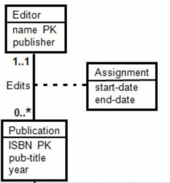
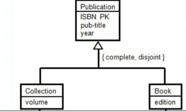
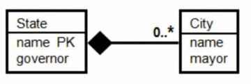
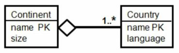

# Kahoot 2 -  UML Data Modeling I

1. How many classes are in {books, publishers, authors, book titles and book year}?
    > 3 classes

2. How many associations would you create between book, publisher and author? 
    > 2

3. What would be the multiplicity of the association between book and author?
    > many-to-many

4. What would be the multiplicity of the association between book and publisher?
    > many-to-one

# Kahoot 2 -  UML Data Modeling II

1. Which of the following statements is correct?
    > Assignment dates can be moved to the publication
    
    

2. Which of the following statements is correct?
    > A publication is either a collection or a book. 

    

3. Which of the following statements is correct?
    > No two states can have the same name. 

    

4. Which of the following statements is correct?
    > No two countries can have the same name. 

    

