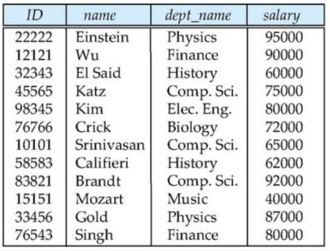
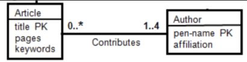
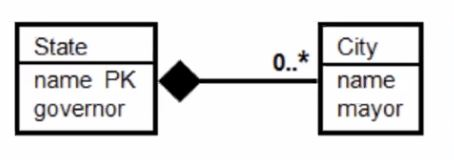
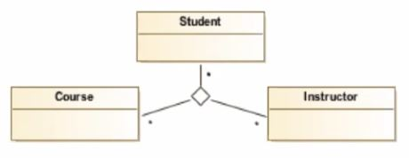

# Kahoot 3 - From UML to Relations I

1. Regarding the presented relation, which of the following statements is correct?
    > The arity is 4 and the cardinality is 12.
    
    

2. How many relations are created from this conceptual model? 
    > 2 or 3

    

3. How many relations are created from this conceptual model? 
    > 3

    

4. Where would the foreign key be, if you map this conceptual model to 2 relations?
    > Publication

    

# Kahoot 3 - From UML to Relations II

1. Which of the following statements is correct?
    > The Assignment relation will have two foreign keys.
    
    

2. Which of the following statements is correct?
    > The City relation will have a foreign key.

    

3. How many relations can be created from this model? 
    > 2 relations with the "Object-oriented" strategy.

    

4. The relation that will be created for the association...
    > will have a primary key and 3 foreign keys.

    

