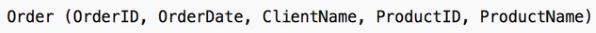
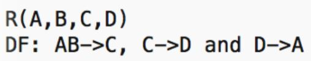
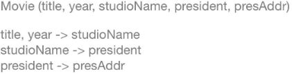
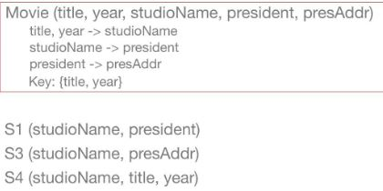

# Kahoot 4 - Relational Model Theory I

1. This relation has redundancy because...
    > the name of the product with id=5 is stored more than once.
    
    

2. Identify a deletion anomaly. 
    > Removing old orders, you may lose clients.

    

3. The set of relations created by decomposition for preventing anomalies is called: 
    > normal forms.

4. Identify the correct statement.
    > OrderID -> OrderDate

    

# Kahoot 4 - Relational Model Theory II

1. Which functional dependency is completely non-trivial?
    > A->B.

2. AB->A can be obtained: 
    > using the trivial or transitive rules.

    

3. What is the closure of {A,C}?
    > {A,C,D}.

    

4. Identify the correct statement.
    > {A,B} is a key of R.

    

# Kahoot 4 - Relational Model Theory III

1. Identify the correct statement.
    > {A,B} is both a key and a superkey of R.

    

2. Identify the correct statement.
    > {C->A} follows from the above functional dependencies.

    

3. R(A,B,C,D) is in the 3rd Form if...
    > for every functional dependency, the left side is a key.

4. For R1 and R2 and R3 to be a decomposition of R, ...
    > the attributes of R are in either R1, R2 or R3.

# Kahoot 4 - Relational Model Theory IV

1. Is the Movie relation in BCNF?
    > No, there are 2 BCNF violations.

    

2. Compute the functional dependencies for Movie2 (studioName, title, year, presAddr).
    > title, year->studioName and studioName->pressAddr

    

3. Decompose Movie to BCNF starting with studioName->president. The final decomposed schema...
    > will have 3 relations with a common attribute.

    

4. The tableau of the chase test will have ...
    > 5 columns and 3 lines.

    

# Kahoot 4 - Relational Model Theory V

1. Let R(A,B,C,D,E) have B->E and CE->A. The decomposition in R1(A,B,C); R2(B,C,D) and R3(A,C,E):
    > is not lossless because there is not an unsubscripted row.

2. Is the Movie relation in 3NF?
    > No, there are two 3NF violations.

    

3. Find a minimal base for the following functional dependencies...
    > The given DFs are their own minimal basis.

    

4. How many relations will result from the 3NF decomposition?
    > 3 + 0 for the superkey.

    

