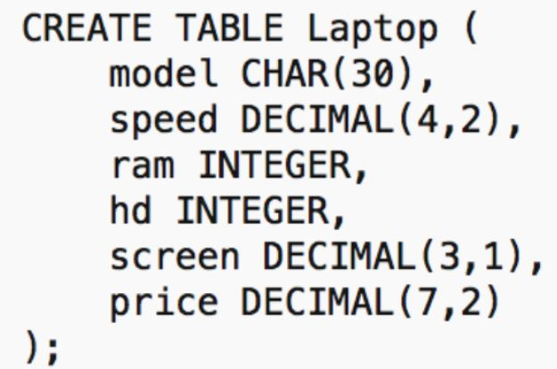
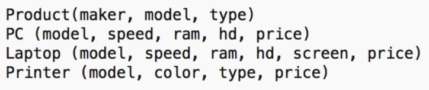
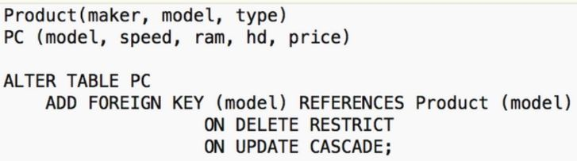

# Kahoot 5 - Data Definition Language I

1. Normally, how would the model 'G62-340-US' be stored?
    > G62-340-US' + 20 blank chars
    
    

2. Can this table be created in SQLite? 
    > Yes, CHAR would be converted to TEXT and DECIMAL to REAL.

    

3. How do you alter Laptop to eliminate the attribute screen?
    > ALTER TABLE Laptop DROP screen.

    

4. Alter the Laptop schema to add the attribute opt-disk with a default value of 'none'.
    > ALTER TABLE Laptop ADD opt-disk CHAR(10) DEFAULT 'none';

    

# Kahoot 5 - Data Definition Language II
1. Constraints can be declared...
    > after the original schema even if data has been inserted.
    
2. The presented constraint be checked should be checked every time there is an 
    > insert or update on the database affecting model.

    

3. If you want to impose that hd is always higher than ram what constraint would you create?
    > Tuple-based constraint.

    

4. What constraint would you use to define a candidate key that was not selected for primary key?
    > Unique constraint.

# Kahoot 5 - Data Definition Language III
1. How many foreign keys would you suggest for the presented database?
    > 3, 1 in PC + 1 in Laptop + 1 in Printer.

    
    
2. Every model on PC must be in Product.All violations set referencing values to NULL. Foreign key
    > in PC with ON DELETE and ON UPDATE SET NULL.

    

3. What happens when PCs with model 'G62-340-US' are updated to 'G72-340-US'?
    > Nothing, if 'G72-340-US' exists in the Product table.

    

4. Constraint naming...
    > is optional and useful when errors occur.
