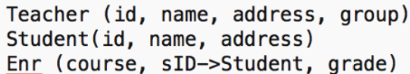
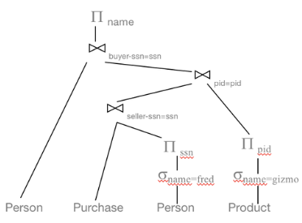

# Kahoot 6 - Relational Algebra I

1. List the names of the teachers of group 12. [Ver imagem com pergunta](P1.png)

2. List the names of the students enrolled in the course 456. [Ver imagem com pergunta](P2.png)

3. Student [semijoin] Teacher returns: [Ver imagem com pergunta](P3.png)

4. Which of the following is true? [Ver imagem com pergunta](P4.png)

# Kahoot 5 - Relational Algebra II
1. R(A,B) and S(B,C). Which expression is equivalent to... [Ver imagem com pergunta](P5.png)
    
2. Which of the following is true? [Ver imagem com pergunta](P6.png)

3. What does this expression returns?
    > Names of the buyers of gizmo selled by fred.

    

4. Which of the following is a fundamental operation in relation algebra?
    > None of the mentioned.
