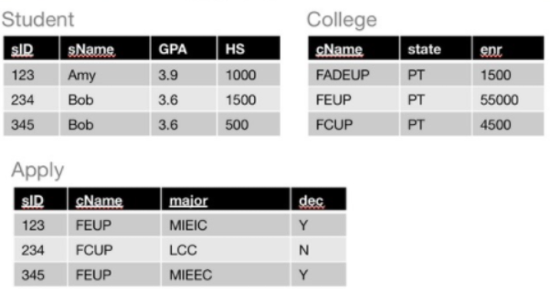
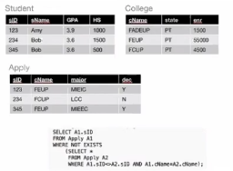
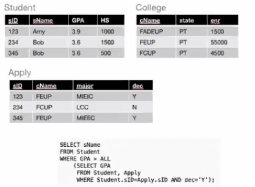
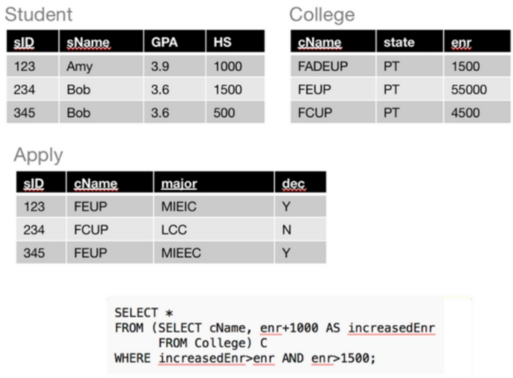
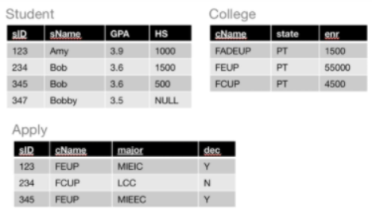
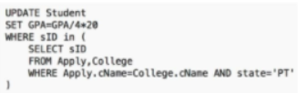

# Kahoot 7 - Data Manipulation Language I

1. SELECT sName FROM Student, Apply WHERE GPA > 3.8;
    > 3 tuples will be returned.

2. SELECT DISTINCT sName, GPA FROM Student;
    > No tuples with the same sName and GPA will be returned.

3. SELECT cName, enr FROM College WHERE cName like '%F_UP%;
    > 2 tuples will be returned.

4. SELECT sName FROM student S1, student S2 WHERE S1.GPA=S2.GPA;
    > An error will be generated.

# Kahoot 7 - Data Manipulation Language II
1. SELECT cName FROM College; <operator> SELECT cName FROM Apply;
    > 3 tuples will be returned with UNION and 6 with UNION ALL

    
    
2. What will be returned for the query in the image?
    > 1 tuple

    

2. What will be returned for the query in the image?
    > 0 tuples

    

3. SELECT cName FROM College WHERE NOT IN (SELECT cName FROM Apply WHERE dec='N');
    > An error will be generated.

    

# Kahoot 7 - Data Manipulation Language III
1. How many tuples are returned?
    > An error will be returned.

    
    
2. In the SELECT clause
    > subqueries returning 1 column and 1 tuple can be used.

3. SELECT cName FROM College NATURAL LEFT JOIN Apply;
    > 4 tuples will be returned.

    

4. SELECT state, major, dec FROM College FULL OUTER JOIN Apply using(cName);
    > 4 tuples will be returned.

    

# Kahoot 7 - Data Manipulation Language IV

1. SELECT sName, min(GPA), avg(GPA), max(GPA) FROM Student;
    > This query returns misleading results.

2. SELECT S.sID, count(dec) FROM Student S, Apply A WHERE S.SID=A.SID GROUP BY S.sID;
    > The num of applications having decisions per student.

3. SELECT cName, S.SID, min(GPA) FROM Student S, Apply A WHERE S.sID=A.sID GROUP BY cName;
    > The query might not return the correct result.

4. SELECT cName, avg(GPA) FROM Student NATURAL JOIN Apply GROUP BY cName HAVING dec LIKE 'Y'.
    > The query is syntactically wrong.

# Kahoot 7 - Data Manipulation Language V

1. SELECT avg(HS) FROM Student;
    > The answer is 1000.
    
2. The query...
    > updates 3 tuples.

    

3. SELECT * FROM Student S1, Student S2 WHERE S1.HS=S2.HS;
    > This query returns 3 rows.

4. INSERT INTO Student(sName, GPA) VALUES('Louise', 3.9); * Executado no SQLite *
    > Inserts the tuple (348, 'Louise', 3.9, NULL) in Student.
