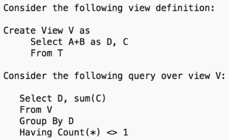

# Kahoot 8 - Views

1. Identify possible reasons to use views.
    > To make queries simpler.

2. When we run a query that refers to a view...
    > query is rewritten using all the base tables of the view.

3. When views are dropped...
    > the definition of the view is removed from the database.

4. T(A, B, C) has the tuples: (1, 1, 3), (1, 2, 3), (2, 1, 4), (2, 3, 5), (2, 4, 1), (3, 2, 4), and (3, 3, 6).
    > (5, 9) is in the query result.

    
