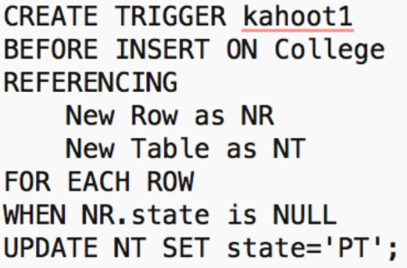
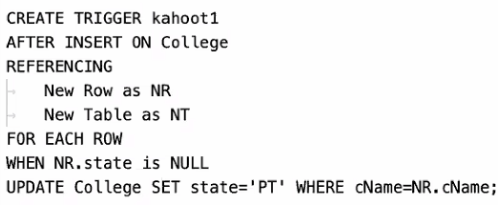

# Kahoot 9 - Triggers

1. Which of the following is true concerning triggers?
    > They have an event, condition, and action.

2. What referencing variables can be used in statement-level AFTER INSERT triggers?
    > NEW TABLE

3. After the execution of this trigger:
    > Henceforward, no NULL states will be inserted in College.

    

4. The effect of this trigger...
    > two of the other options.

    

5. After the execution of this trigger:
    > Inserted tuples with NULL states will have 'PT' as the state.

    

6. The effect of this trigger...
    > two of the other options.

    