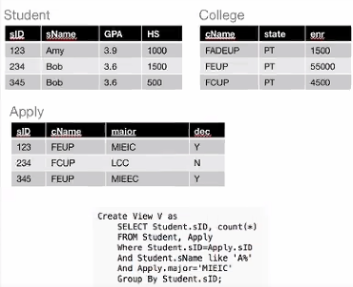
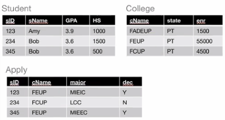
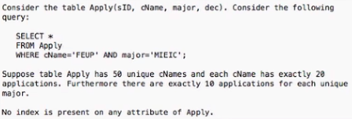
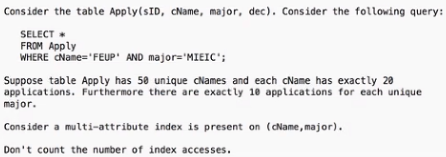

# Kahoot 10 - Indexes

1. Identify a possible reason for this view not being updatable according to the SQL standard.
    > Use of aggregate function COUNT.

    

2. Consider a view "SameGPA" containing pairs of student ids with the same GPA.
    > This view is updatable using instead-of-triggers.

    

3. What is the maximum number of tuples that might me accessed to answer the query?
    > 1000

    

4. The maximum number of tuples that might be accessed to answer the first result of the query is
    > 1

    