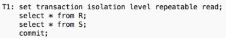

# Kahoot 11 - Transactions

1. T1 has a serializable behaviour...
    > with transactions without inserts.

    

2. Consider two money transfers: #1 (from account A to account B) and #2 (from B to A)
    > A transaction should be created on both transfers.

3. What ensures that once transaction changes are done, they cannot be undone or lost?
    > Durability

4. Which of the following has "all-or-none" property?
    > Atomicity
