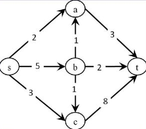
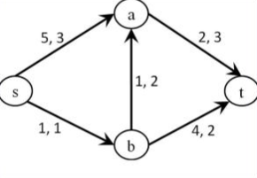

# Kahoot 8 - Duplicate of Graphs: Maximum Flow & Minimum Cost Flow
1. Consider the directed graph in the figure. What is the maximum flow from s to t?
    
    > * 5
    > * **9 :heavy_check_mark:**
    > * 10
    > * 13
     
2. Let (S,T) be a minimum cut in the graph G. Suppose we add 1 to the capacity of every edge in G.
    > * (S,T) will still be a minimum cut
    > * (S,T) cannot be a minimum cut
    > * **(S,T) can be or not a minimum cut :heavy_check_mark:**
    > * The capacity will be 1 flow unit greater

3. What is the minimum cost flow (for maximum flow) from s to t? note: edges are labeled as "cost, capacity"
     
    > * 7
    > * 11
    > * 14
    > * **18 :heavy_check_mark:**

