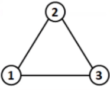
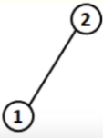
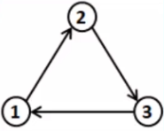
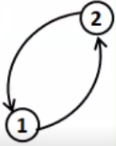
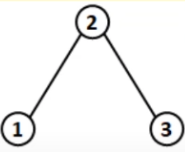
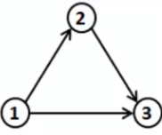

# Kahoot 4 - Graph Theory: concepts
1. Consider an edge e in a digraph G=(V,E), with e=(u,v) belonging to E, and u,v belonging to V. About e, it is correct to say:
    > * (u,v) = (v,u)
    > * u is adjacent to v
    > * u and v are adjancent to each other
    > * **v is adjacent to u :heavy_check_mark:**
     
2. Which of the following graphs does NOT represent a cycle/circuit?
    > * 
    > * ** :heavy_check_mark:**
    > * 
    > * 

3. Which of the following graphs is weakly connected?
    > * 
    > * 
    > * ** :heavy_check_mark:**
    > * 

4. A graph is said to be dense, if:
    > * **|E| ~ O(V^2) :heavy_check_mark:**
    > * |E| = |V|
    > * |V| ~ O(E^2)
    > * |V| > |E|

5. The spaces necessary for adjacent lists and adjacent matrixes in graph representation are, respectively:
    > * |E|^2 and |E| + |V|
    > * |E|^2 and |V|^2
    > * |E| and |V|
    > * **|E| + |V| and |V|^2 :heavy_check_mark:**

