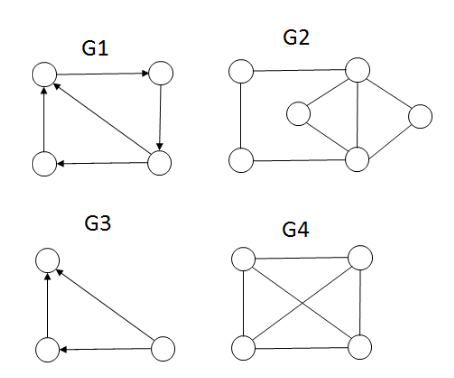
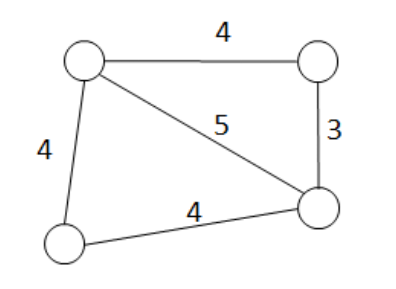
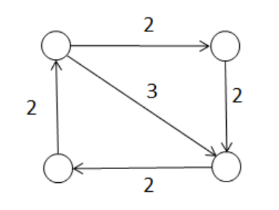

# Kahoot 9 - Graphs: Euler Circuit
1. Which of the following graphs has an Euler circuit?
     
    > * G1
    > * **G2 :heavy_check_mark:**
    > * G3
    > * G4
     
2. Which of the following graphs has an Euler path but not a circuit?
     
    > * **G1 :heavy_check_mark:**
    > * G2
    > * G3
    > * G4

3. What is the length for the optimum Chinese Postman route on the graph below?
     
    > * 15
    > * 20
    > * **25 :heavy_check_mark:**
    > * 27

4. What is the length for the optimum Chinese Postman route on the graph below?
     
    > * 8
    > * 11
    > * 14
    > * **15 :heavy_check_mark:**

## Others
* Um caminho que visita cada aresta de um grafo exatamente uma vez é chamado:
    > * Circuito de Euler
    > * Percurso do Carteiro Chinês
    > * Circuito de Hamilton
    > * **Caminho de Euler :heavy_check_mark:**

* Um grafo não dirigido contém um caminho de Euler se e só se
    > * é conexo e cada vértice tem o mesmo grau de entrada e saída
    > * é conexo e cada vértice tem grau par
    > * **é conexo e todos menos dois vértices têm grau par :heavy_check_mark:** 
    > * é fortemente conexo

* Um grafo dirigido contém um circuito de Euler se e só se é fortemente conexo e
    > * **cada vértice tem o mesmo grau de entrada e saída :heavy_check_mark:** 
    > * cada vértice tem grau par
    > * todos menos dois vértices têm grau par
    > * todos menos dois vértices têm o mesmo grau de entrada e saída

* Um circuito de Euler pode ser encontrado em tempo
    > * **O(|E| + |V|) :heavy_check_mark:** 
    > * O(|E| |V|)
    > * O(|V| log |E|)
    > * O(|E| log |V|)

* Qual das seguintes não é uma característica de um percurso ótimo do carteiro chinês?
    > * caminho fechado
    > * caminho de peso mínimo
    > * atravessa cada aresta pelo menos uma vez
    > * **passa em cada aresta exatamente uma vez :heavy_check_mark:** 