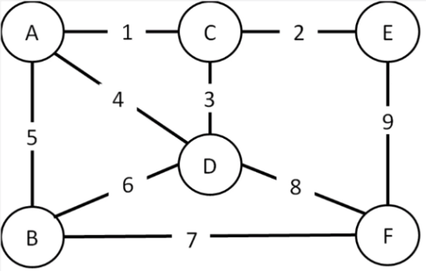
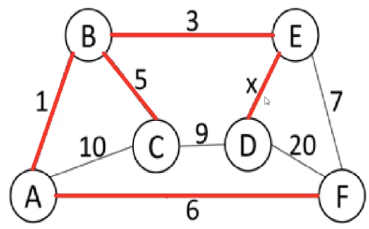
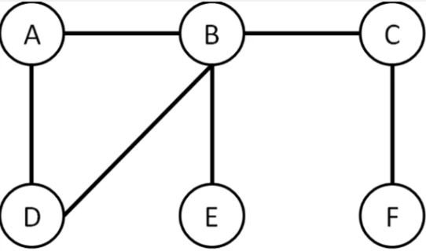
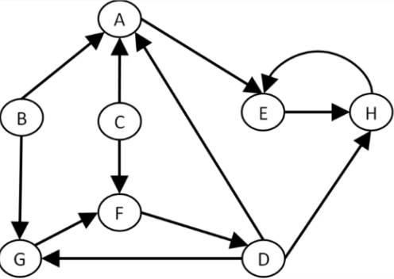

# Kahoot 7 - Graphs: Minimum Spanning Tree & Connectivity
1. Consider the graph in the figure. What is the lenght of the minimum spanning tree (sum of edges' values)?
     
    > * 16
    > * **18 :heavy_check_mark:**
    > * 21
    > * 24
     
2. In the following graph, red edges form a minimum spanning tree. What is the range os values for x (less restricted)?
     
    > * x<=3
    > * x<=7
    > * **x<=9 :heavy_check_mark:**
    > * x<=20

3. Identify the articulation points in the following undirected graph:
     
    > * E and F, only
    > * B, E and F, only
    > * **B and C, only :heavy_check_mark:**
    > * There are no articulation points

4. How many strongly connected components are in the following directed graph?
     
    > * 2
    > * 3
    > * 4
    > * **5 :heavy_check_mark:**

