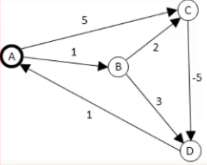
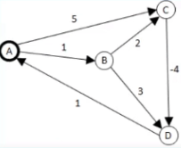
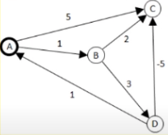
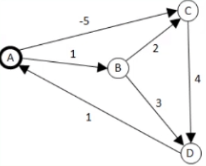

# Kahoot 6 - Graphs: shortest paths and applications
1. What is the time complexity of Dijkstra's algorithm, with mutable priority queues, for dense graphs?
    > * O( log |V| )
    > * O( log(|V|+|E|) )
    > * **O( (|V|+|E|) log |V| ) :heavy_check_mark:**
    > * O( |V| log |E|)
     
2. What is the time complexity of Bellman-Ford's algorithm for DAGs (directed acyclic graph)?
    > * **O( |E| |V| ) :heavy_check_mark:**
    > * O( |E|^2 )
    > * O( |V|^2 )
    > * O( |E| + |V| )

3. What are the time and space complexities of Floyd-Warshall's algorithm for sparse graphs, respectively?
    > * O( |V|^2 ) and O( |V|^2 )
    > * **O( |V|^3 ) and O( |V|^2 ) :heavy_check_mark:**
    > * O( log |V|^3 ) and O( |V|^2 )
    > * O( |V|^3 ) and O( log |V|^2 )

4. Considering A as the source vertex in one-to-all shortest path algorithms, which of the graphs has a negative cycle?
    > * ** :heavy_check_mark:**
    > * 
    > * 
    > * 

5. What is the critical path in project management?
    > * The shortest duration sequence of dependent tasks with slack (folga)
    > * The longest slack (folga) among all tasks
    > * The shortest slack (folga) among all tasks
    > * **The longest duration sequence of dependent tasks with no slack (folga) :heavy_check_mark:**

