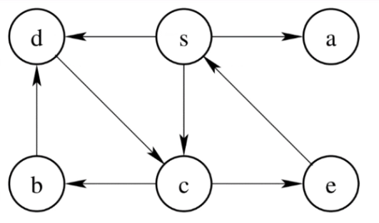
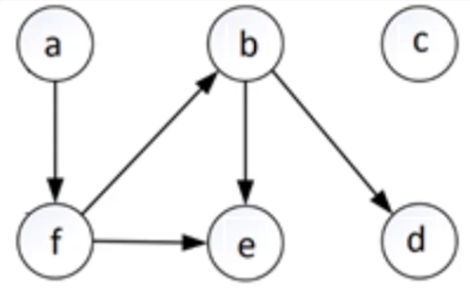

# Kahoot 5 - Graphs Theory: search and topological order
1. Which sequence is a DFS (Depth First Search) traversal, starting with s? Ties are broken by the alphabetic order.
     
    > * s a c d b e
    > * **s a c e b d :heavy_check_mark:**
    > * s c b e a d
    > * s a c d e b
     
2. Which sequence is a BFS (Breadth First Search) traversal, starting with s? Ties are broken by the alphabetic order.
     
    > * **s a c d e b :heavy_check_mark:**
    > * s d c e a d 
    > * s b c e d a 
    > * s a c d e b

3. Consider the graph in the figure. Which sequence is a topological sort?
     
    > * c a b f d e
    > * **a f b c d e :heavy_check_mark:**
    > * a c e b f d 
    > * c a b d e f

4. Which of the following statements is true?
    > * A topological ordering exists in every directed graph
    > * Every acyclic graph has exactly one topological ordering
    > * **Every acyclic graph has at least one topological ordering :heavy_check_mark:**
    > * Every acyclic graph has has at most one topological ordering

