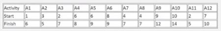

# Kahoot 1 - Greedy Algorithms

1. When do Greedy Algorithms choose the best candidate solution?
    > At each iteration of the process.
    
2. A problem is said to have optimal substructure if:
    > An optimal solution is builds up from optimal solutions of its subproblems.

3. What is the maximum number of activities that can be completed without any conflicts? (see start & finish times in Fig.)
    > 4 

    

4. The worst-case complexity of the greedy activity selector, given n activities ordered by increasing finish time, is:
    > n. 

5. Considering unlimited stock, a coin system {1, c2, ..., cn} is said to be canonical if a greedy algorithm:
    > always finds the optimum solution for the change-making problem. 

