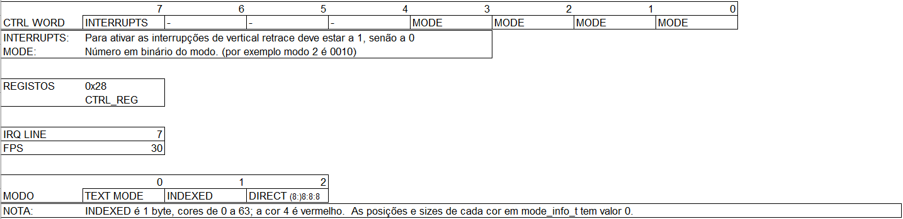

# Placa gráfica - enunciado do recurso de 2021



### FUNÇÕES E ESTRUTURAS FORNECIDAS
* ```int get_mode_info(uint16_t mode, mode_info_t *inf); ```
* ```uint8_t *map_phys_mem(size_t base, size_t size);```
* ```int display_mode_info(uint16_t mode); // Apenas para debug```
* ```
    typedef struct 
    {
        uint16_t x_res, y_res;
        uint8_t bpp, r_pos, r_sz, b_pos, b_sz, g_pos, g_sz;
        phys_addr_t phys_addr;
    } mode_info_t;
  ```
### PARA IMPLEMENTAR 
* Usa [este](pp_skel.txt) ficheiro como ponto de partida.
* Ou então vê logo [esta](pp_sol.txt) solução. 

* For the first part you must set the respective mode, map the memory address and draw a square with the specified parameters. After 'delay' seconds (use the sleep() function) you must exit graphics mode. In this part you MUST NOT use interrupts.

```
/**
* x, y: top-left coordinates of the square
* len: length of the square (if the square does not fit the screen, draw only the part inside the screen)
* color: color of the square (1 unused byte, 1 byte for red, 1 byte for green, 1 byte for blue, in that order)
* delay: seconds to wait before exiting
*/
int part1(uint16_t x, uint16_t y, uint16_t len, uint32_t color, uint8_t delay);
```

* For the second part, you must now use vertical retrace interrupts. Draw a square with the specified parameters (similar to part 1) but after 'delay' seconds the square must have its coordinates 'flipped' (top left pixel in position (y, x)). After other 'delay' seconds you must exit graphics mode.

```
/**
* x, y: top-left coordinates of the square
* len: length of the square (if the square does not fit the screen, draw only the part inside the screen)
* color: color of the square (1 unused byte, 1 byte for red, 1 byte for green, 1 byte for blue, in that order)
* delay: seconds to wait before exiting
*/
int part2(uint16_t x, uint16_t y, uint16_t len, uint32_t color, uint8_t delay);
```

```
/**
* mode: the mode to be set
* x, y: top-left coordinates of the square
* len: length of the square (if the square does not fit the screen, draw only the part inside the screen)
* color: color of the square (1 unused byte, 1 byte for red, 1 byte for green, 1 byte for blue, in that order)
* delay: seconds to wait before exiting
*/
int test_draw_square(uint16_t mode, uint16_t x, uint16_t y, uint16_t len, uint32_t color, uint8_t delay) 
{
    // IMPLEMENT YOUR SOLUTION HERE
    int vr;
    // Part 1
    vr = part1(x, y, len, color, delay);

    // Part 2. Only implement and uncomment if part 1 passes the first 4 tests, otherwise
    // you won't get marks for part 2.
    // vr = part2(x, y, len, color, delay);

    return vr;
}
```
### Testes
* -t 1 Checks memory mapping
* -t 2 Set mode 
* -t 3 Revert to text mode
* -t 4 Draw square (part 1) [If you implement part 2, this test will fail. -t 5 will be the one used in your evaluation]
* -t 5 Draw first square (part 2)
* -t 6 Draw both squares
* -t 7 Draw both squares (can't be both in the screen at the same time)
